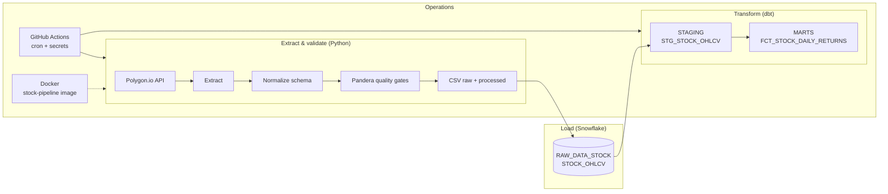
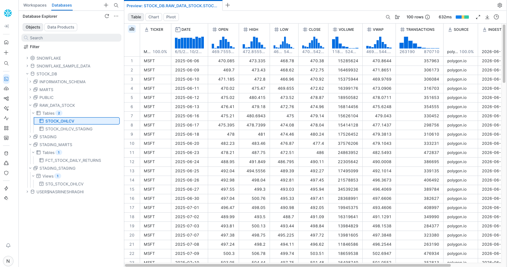

# Polygon → Snowflake OHLCV Pipeline

**A production-style stock data pipeline for learning and portfolios** — ingest daily OHLCV bars from [Polygon.io](https://polygon.io), enforce data quality with Pandera, load into Snowflake with idempotent MERGE, model analytics in dbt, and refresh on a schedule with GitHub Actions.

[](https://github.com/nasrineshraghi/stock-trading-app-data-enginner/actions/workflows/ci.yml)

| | |
|---|---|
| **Data source** | Polygon.io REST API (`/v2/aggs`) |
| **Warehouse** | Snowflake (`STOCK_DB`) |
| **Transform** | dbt (staging view + daily returns mart) |
| **Automation** | GitHub Actions cron + Docker |
| **Quality** | Pandera schema + OHLC business rules, ~87% test coverage |

**Step-by-step guides:** [Level 1 — ingest & Snowflake](docs/LEVEL1.md) · [Level 2 — incremental, dbt, cron, Docker](docs/LEVEL2.md)

---

## What this project does

End-to-end **ELT** for US equity daily bars:

1. **Extract** OHLCV from Polygon for one or many tickers  
2. **Validate** prices, volumes, and OHLC logic before anything is persisted  
3. **Load** raw + processed CSVs locally, then **MERGE** into Snowflake on `(ticker, date)`  
4. **Transform** with dbt into a staging view and a mart with `daily_return_pct`  
5. **Automate** incremental loads on a cron (and optionally run the same CLI in Docker)

Built to demonstrate patterns hiring managers expect: incremental loads, upserts, tests, CI, analytics modeling, and scheduled jobs — without hiding complexity behind a notebook.

---

## Architecture



### Snowflake layers

| Schema | Object | Role |
|--------|--------|------|
| `RAW_DATA_STOCK` | `STOCK_OHLCV` | Raw OHLCV from Python MERGE (source of truth) |
| `STAGING` | `STG_STOCK_OHLCV` | dbt view — cleaned column names, typed fields |
| `MARTS` | `FCT_STOCK_DAILY_RETURNS` | dbt table — daily % return vs previous close |

### Snowflake preview

Raw layer after ingest (`STOCK_DB.RAW_DATA_STOCK.STOCK_OHLCV`):



*Polygon-sourced bars with quality metadata (`source`, `ingested_at`). Analytics models live in `STAGING` and `MARTS` — see [Level 2](docs/LEVEL2.md).*

Add more screenshots under `docs/assets/` (e.g. mart query results, dbt test output) and link them here.

---

## Quick start

### 1. Install

```bash
python -m venv .venv && source .venv/bin/activate
pip install -e ".[dev,snowflake]"
cp .env.example .env   # add POLYGON_API_KEY (+ SNOWFLAKE_* for warehouse load)
```

### 2. Ingest to CSV

```bash
stock-ingest ingest AAPL --start 2025-06-01 --end 2025-06-05
stock-ingest validate data/processed/AAPL_2025-06-01_2025-06-05.csv
```

### 3. Load to Snowflake

```bash
stock-ingest ingest AAPL --incremental --snowflake
stock-ingest ingest-batch config/tickers.example.txt --incremental --snowflake
```

One-time Snowflake setup (database, schema, grants): [Level 1 guide](docs/LEVEL1.md).

### 4. dbt analytics

```bash
pip install -e ".[dbt]"
cp dbt/profiles.yml.example dbt/profiles.yml
export $(grep -v '^#' .env | xargs)

make dbt-run && make dbt-test
```

### 5. Docker (optional)

Same CLI, reproducible environment:

```bash
make docker-build
make docker-ingest-batch          # incremental batch → Snowflake
make docker-ingest TICKER=AAPL START=2025-06-01 END=2025-06-05 SNOWFLAKE=1
```

Secrets via `--env-file .env`; CSVs written to `./data` on the host.

---

## CLI reference

| Command | Description |
|---------|-------------|
| `stock-ingest ingest TICKER ...` | Single or multi-ticker ingest |
| `stock-ingest ingest-batch FILE ...` | Tickers from file (see `config/tickers.example.txt`) |
| `stock-ingest validate FILE` | Run Pandera checks on an existing CSV |
| `--incremental` | Only dates after last load (Snowflake or CSV) |
| `--snowflake` | MERGE upsert after validation |
| `-v` / `--verbose` | Debug logging |

---

## Data quality

Every row passes:

- **Schema** — required columns, types, non-nulls  
- **Bounds** — prices and volume ≥ 0  
- **OHLC logic** — `high ≥ open/close/low`, `low ≤ open/close`  
- **Uniqueness** — one row per ticker + date  

Failed checks block the processed CSV and Snowflake load.

---

## CI/CD

| Workflow | Trigger | What it does |
|----------|---------|--------------|
| [`ci.yml`](.github/workflows/ci.yml) | Push / PR | Ruff lint, pytest (3.11 + 3.12), quality dry-run |
| [`scheduled-ingest.yml`](.github/workflows/scheduled-ingest.yml) | Cron (Mon 6 UTC) + manual | Incremental ingest → Snowflake → `dbt run` + `dbt test` |

Scheduled runs need GitHub secrets: `POLYGON_API_KEY` and `SNOWFLAKE_*` ([checklist](docs/LEVEL2.md#31-github-secrets)). CI uses mocks — no live credentials.

---

## Development

```bash
make lint
make test
```

Typical loop: edit → lint → test → commit → push (CI runs automatically).

---

## Project layout

```
src/stock_pipeline/     Python ELT (extract, quality, Snowflake MERGE, CLI)
dbt/                      Staging + mart models, schema tests
config/                   Ticker lists for batch / scheduled ingest
.github/workflows/        CI + scheduled incremental pipeline
docs/                     Level 1 & 2 guides, assets (screenshots)
Dockerfile                Containerized CLI (Snowflake extras)
tests/                    Unit + integration (~87% coverage)
```

---

## Schema (raw / processed CSV & Snowflake)

| Column | Description |
|--------|-------------|
| `ticker` | Symbol (e.g. AAPL) |
| `date` | Trading date |
| `open`, `high`, `low`, `close` | OHLC prices |
| `volume` | Share volume |
| `vwap` | Volume-weighted average price |
| `transactions` | Trade count |
| `source` | `polygon.io` |
| `ingested_at` | ISO timestamp of extraction |

---

## Portfolio one-liner

> I built an incremental Python ELT pipeline from Polygon into Snowflake, validated OHLCV with Pandera, modeled staging and mart tables in dbt with tests, scheduled refreshes in GitHub Actions, and packaged the ingest CLI in Docker.

---

## License & notes

- `.env`, `dbt/profiles.yml`, and generated CSVs are gitignored — never commit secrets.  
- Polygon free tier limits history (~2 years); use recent dates on first runs.  
- Repo folder name may differ from the display title above; the pipeline is the [`stock-pipeline`](pyproject.toml) Python package.
